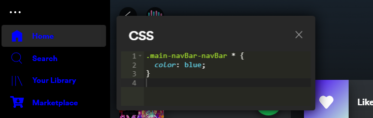

<div align=center>


<h1>Stylizer</h1>

<p>🧩 Customize Spotify's look in the real time.</p>

<p align="center">
  
</p>

</div>

## Features

- Immediate feedback.
- Edit CSS directly in Spotify.
- Autocompletion and syntax highlighting with Ace Editor.
- A floating, draggable, and resizable editor window.
- A configurable key shortcut to quickly open and close the editor.

## Installation

### Installer (recommended)

Open Windows command prompt and paste this:

```bash
powershell -c "irm https://raw.githubusercontent.com/woidzero/stylizer/refs/heads/master/install.bat | iex"
```

### Spicetify Marketplace

You can install this extension from the Spicetify Marketplace, just search for "Stylizer" and click install.

### Manual

1. Download [stylizer.js](./dist/stylizer.js) and place it inside your Spicetify extensions folder:
2. Open Spicetify extensions directory:

```bash
spicetify config-dir
```

3. Put [stylizer.js](./dist/stylizer.js) in the 'Extensions' folder.
4. Apply the changes:

```
spicetify config extensions stylizer.js
spicetify apply
```

## Credits

- [FlafyDev's spotify-css-editor](github.com/FlafyDev/spotify-css-editor) - for initial codebase.

## License

`stylizer` is distributed under the terms of the [MIT License](LICENSE).
